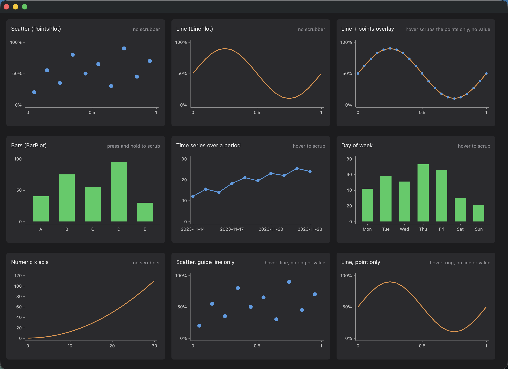

# gpui-charts

Chart components for [gpui](https://www.gpui.rs/), Zed's GPU-accelerated UI framework.

## Usage

`Graph` is a gpui element. You can build one via one of the provided builders then drop it in a layout.

```rust
use gpui::{div, prelude::*};
use gpui_charts::{PlotKind, TimeSeriesBuilder, ValueAxis};

let graph = TimeSeriesBuilder::new()
    .samples([(1_700_000_000, 3.0), (1_700_086_400, 5.5), (1_700_172_800, 4.0)])
    .y_axis(ValueAxis::default().range(0.0, 10.0))
    .plot_kind(PlotKind::Line)
    .plot_kind(PlotKind::Points)
    .build()?;

div().size_full().child(graph)
```

## Plots

A graph paints one or more plots in the order they're added, so they can be
layered (points over a line, for instance).

- **PointsPlot**: A circular point at each sample. Use it alone for a scatter chart or over a line to emphasize the samples.
- **LinePlot**: A simple line through all provided samples
- **BarPlot**: A vertical bar plot for each sample.

## Builders

Three series builders normalize real-world values and label the axes for you:

- **TimeSeriesBuilder**: Plots `(timestamp, value)` samples over a period. Labels default to `YYYY-MM-DD` in UTC and take a custom formatter.
- **WeekdayBuilder**: Plots values into seven evenly spaced weekday buckets. Days without a value are left empty.
- **NumericSeriesBuilder**: Plots `(x, y)` samples where `x` is any numeric quantity. Both axes are normalized and labeled from the observed or fixed ranges.

When you already have coordinates in the `0..=1` range, the raw builders take
them directly:

- **GraphBuilder**: Assembles a `Graph` from plots and axes.
- **AxesBuilder**: Builds the axes from labels at normalized positions.
- **PointsPlotBuilder**, **LinePlotBuilder**, **BarPlotBuilder**: Build a single plot from normalized points.

### Scrubbing

Any plot can be scrubbed with the pointer. Scrubbing is off until you give the
plot a `ScrubOptions`, which starts from one of two triggers and can then be
tuned with the following options:

```rust
use gpui::rgb;
use gpui_charts::{ScrubOptions, TimeSeriesBuilder};

// Highlight the nearest sample whenever the pointer is over the graph.
let scrub = ScrubOptions::hover()
    // Draw the sample's value above the highlighted point.
    .with_show_value(true)
    .with_value_color(rgb(0xfafafa))
    // Draw a vertical guide line through the sample.
    .with_guide(true)
    .with_guide_color(rgb(0x52525b))
    // Draw a ring around the sample's point.
    .with_point(true)
    .with_point_color(rgb(0x60a5fa));

let graph = TimeSeriesBuilder::new()
    .samples(samples)
    .scrub(scrub)
    .build()?;

// Or highlight only while the primary mouse button is held down.
let scrub = ScrubOptions::press_and_hold();
```

## Demo

To see a live demo you can run the following:
```bash
cargo run --bin demo
```

## Examples

For more examples, please see [examples.rs](src/bin/demo/examples.rs).


